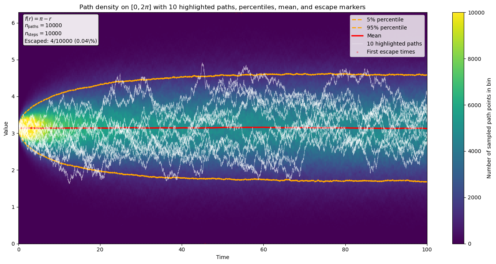
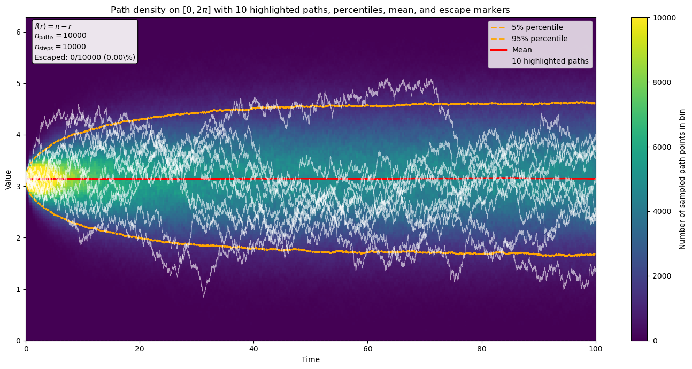

# SDE Project -- MATH 214

**Author:** Johan Jonsson  
**Program:** Graduate student in Mathematical Statistics  
**Course:** MATH 214(UCSD) Introduction to Computational Stochastics

## Overview

This project constructs and analyzes a barrier-type stochastic differential equation (SDE) for an active matter system where particles on a torus must not cross each other. The central challenge is enforcing strict non-escape from the open interval $(0, 2\pi)$; both in the continuous-time theory and in numerical simulation.

Starting from the interacting particle model of [Boffi & Vanden-Eijnden (2024)](https://doi.org/10.48550/arXiv.2309.12991), the project:

1. **Derives a one-dimensional barrier SDE** for the relative distance between two particles, with singular drift terms that repel the process away from the boundary.
2. **Applies Feller's test for explosions** to rigorously prove that the solution stays in $(0, 2\pi)$ almost surely when the drift-to-noise ratio satisfies $\mu \geq \varepsilon$.
3. **Compares three numerical schemes** -- standard Euler-Maruyama, clipped Euler-Maruyama, and backward (drift-implicit) Euler-Maruyama -- and shows that only the backward scheme simultaneously preserves the state constraint, avoids blow-up, and respects the symmetry of the dynamics.

## Key Results

| Scheme | Preserves $(0,2\pi)$? | Moment symmetry | Stationary distribution |
|---|---|---|---|
| Standard Euler-Maruyama | No (escapes) | Unstable spikes | Requires filtering |
| Clipped Euler-Maruyama | Forced (ad hoc) | Systematic bias | Requires filtering |
| **Backward Euler-Maruyama** | **Yes (by construction)** | **Correct** | **Matches theory** |

The backward scheme admits a **closed-form update** via Cardano's formula (the implicit equation reduces to a cubic), avoiding the cost of iterative solvers like Newton's method.

## Skills Demonstrated

- **SDE theory:** Ito calculus, Feller's test for boundary classification, Fokker-Planck equations, stationary distributions, existence and uniqueness theorems (Oksendal Thm 5.2.1)
- **Pseudocode and algorithm design:** Clear pseudocode for the Euler-Maruyama scheme, translating mathematical formulations into implementable algorithms
- **Numerical methods:** Forward and backward Euler-Maruyama schemes, convergence assessment via odd centered moments, KL divergence against exact stationary density
- **Scientific computing:** Vectorized simulation with NumPy, GPU-accelerated Monte Carlo with CuPy (up to $10^7$ paths), memory-adaptive batching
- **Mathematical writing:** Full LaTeX report with rigorous proofs, derivations, and figures

## Project Structure

```
.
|-- README.md
|-- SDE_Project_MATH_214_Johan_Jonsson(submitted version).pdf   # Final report
|-- Latex_files/                  # LaTeX source and compiled PDF
|   |-- main.tex                  # Full report source
|   |-- references.bib            # Bibliography
|   |-- figures/                  # Figures used in the report
|   +-- main.pdf                  # Compiled report
|-- Simulation_code/
|   |-- Intro_vectorized_sim/     # Introductory notebooks
|   |   |-- simple_sde.ipynb      # Vectorized vs standard Euler-Maruyama benchmark
|   |   +-- Simple_repulsion.ipynb # First barrier SDE simulations with path density plots
|   +-- Indepth/                  # Main numerical experiments (GPU/CuPy)
|       |-- analyze_numerical_escaping.ipynb            # Escape percentage vs step size (forward EM)
|       |-- analyze_numerical_escaping_backward.ipynb    # Escape percentage vs step size (backward EM)
|       |-- analyze_numerical_escaping_backward-moments.ipynb  # Odd moment comparison across schemes
|       +-- analyze_numerical_escaping_backward-stationary.ipynb # Stationary distribution comparison
+-- Figures/                      # Generated figures
```

## The Core Problem

In an active matter simulation, particles interact via short-range repulsive forces on a torus. The relative distance $R_t = X_t^1 - X_t^2$ between two particles satisfies:

$$dR_t = 2\mu\left(f(R_t) + \frac{1}{R_t} + \frac{1}{R_t - 2\pi}\right)dt + 2\sqrt{\varepsilon}\,dW_t$$

The singular terms $1/R_t$ and $1/(R_t - 2\pi)$ act as barriers at the boundary, but standard numerical schemes (Euler-Maruyama) can still overshoot due to unbounded Gaussian increments; even with arbitrarily small time steps. The backward Euler-Maruyama scheme resolves this by solving an implicit equation at each step, which always selects the unique root inside $(0, 2\pi)$.

## Sample Figures

| Forward Euler-Maruyama | Backward Euler-Maruyama |
|---|---|
|  |  |
| 4/10,000 paths escaped | 0/10,000 paths escaped |

## Requirements

The simulation notebooks use:
- Python 3.x
- NumPy
- Matplotlib
- CuPy (for GPU-accelerated experiments in `Indepth/`)

## References

- Boffi, N. M. & Vanden-Eijnden, E. (2024). *Deep learning probability flows and entropy production rates in active matter.*
- Oksendal, B. (2013). *Stochastic Differential Equations.* 6th edition. Springer.
- Neuenkirch, A. & Szpruch, L. (2014). *First order strong approximations of scalar SDEs defined in a domain.* Numerische Mathematik.
- Karatzas, I. & Shreve, S. (1991). *Brownian Motion and Stochastic Calculus.* Springer.
- Lee, J. M. (2024). *Finite time blow-up and Feller's test.* (Referenced for Feller's test statement.)